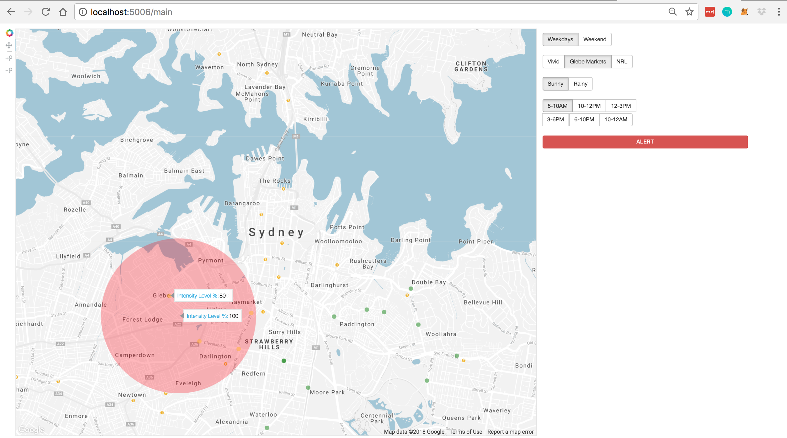
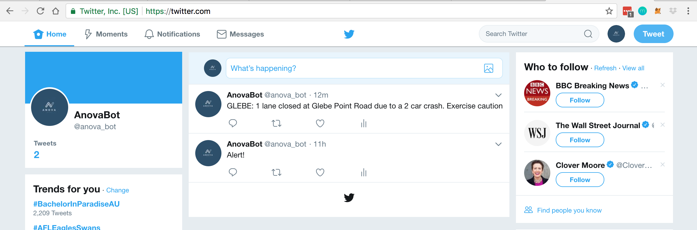

# congestionhack
Our project visualised spots in Sydney on a map that are likely to be congested through machine learning techniques. We were able to highlight different levels of congestion and forecast future congested spots. We were then able to send a tweet out on our public twitter channel.

# Tech Stack
- Bokeh
- Twitter Bot
- Jupyter Notebooks, SKLearn, Pandas, and more.

# Contributors
Supavit Dumrongprechachan, Chris Hyland, Vincey Au, Jerry Xu, Jandy Tenedora, Jose Vera
